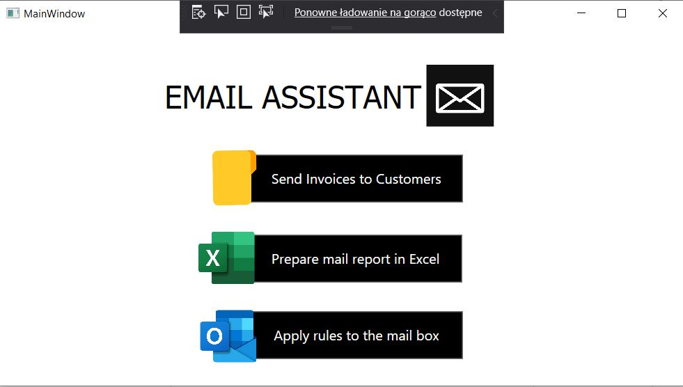
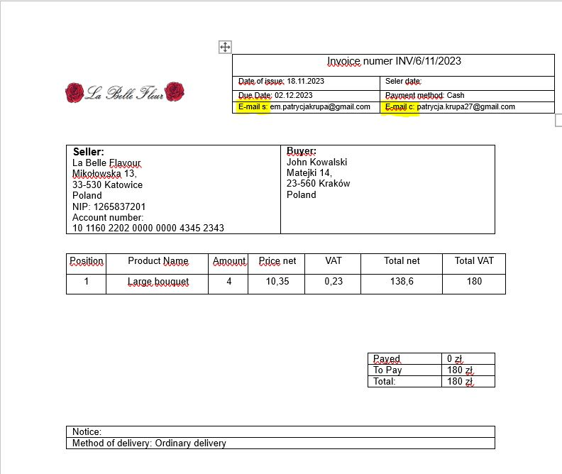
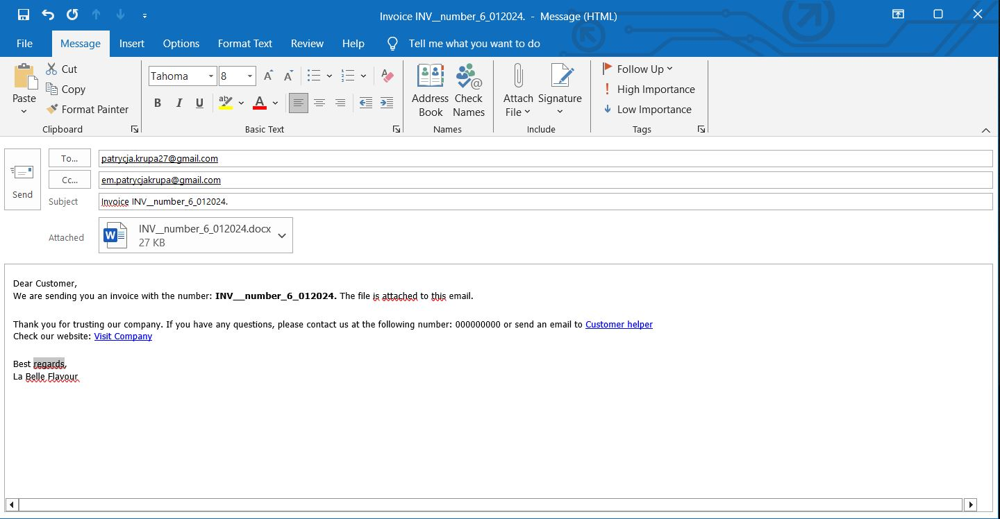
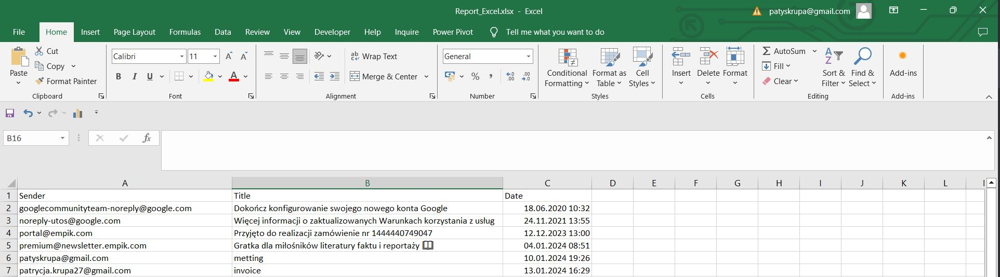
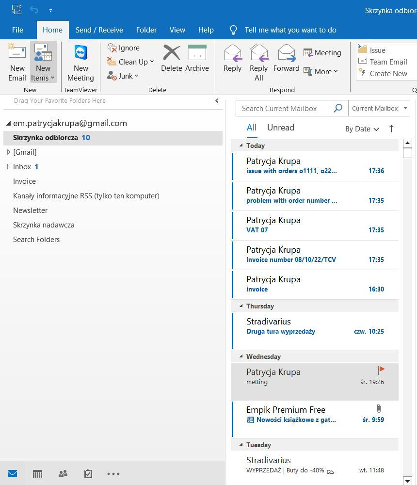
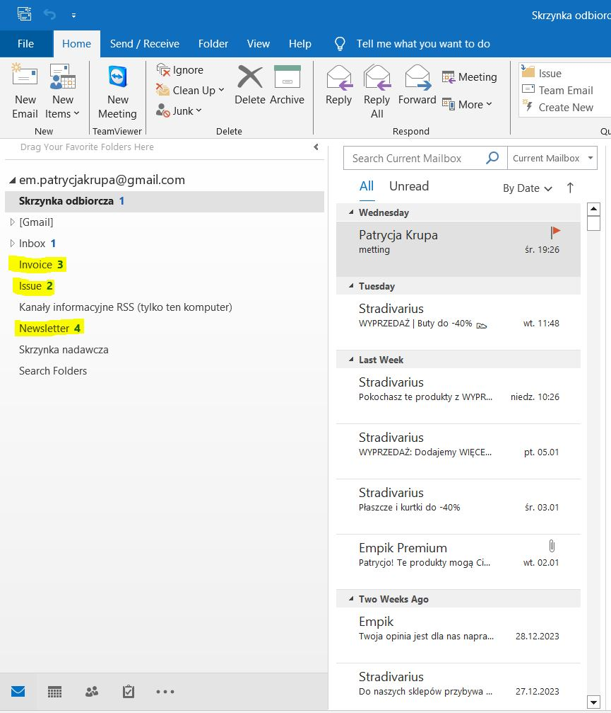

## EMAIL ASSISTANT

The 'EMAIL ASSISTANT' project has been prepared in C#. It is an email assistant that can be used for managing Outlook mailboxes, generating reports in Excel, and supporting bulk invoice sending.

The project is developed in WPF and connects with Outlook, Excel, and Word applications. It enables the automation of repetitive tasks and consists of three modules: bulk invoicing via email, generating a report of unread messages in Excel, and clearing the mailbox based on predefined rules.

## How it works?

The first module, "Send Invoices to Customers," allows for bulk messaging. Upon selecting the button, the user is prompted to specify the folder containing the invoices to be sent. The script then retrieves information about the employee and customer emails from the file.

It prepares an email in Outlook, attaches the invoice as a file, and encodes the message in HTML format. The email includes a link to the company's webpage and a link to the Help Desk email. When the client clicks on it, they are automatically redirected to the appropriate location.

After sending, the invoice is moved to the 'Send' folder. If the folder does not exist, it is created.

The second module, 'Prepare Mail Report in Excel,' enables the automatic generation of a report in Excel containing information about unread messages, including the date sent, subject, and sender. This report can be useful for task allocation in a shared mailbox or for generating statistics.

The last module, 'Apply Rules to the Mailbox,' allows for the automatic moving of emails (unread) to Outlook folders. For example, three rules have been prepared related to invoices, newsletters, and errors reported by clients. These rules are developed using Regex. If the folder does not exist in the user's mailbox, the script will create it and then move the messages accordingly.

The appearance of the mailbox after applying the script.

